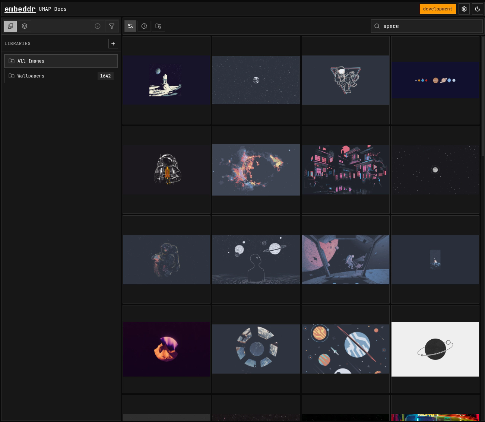
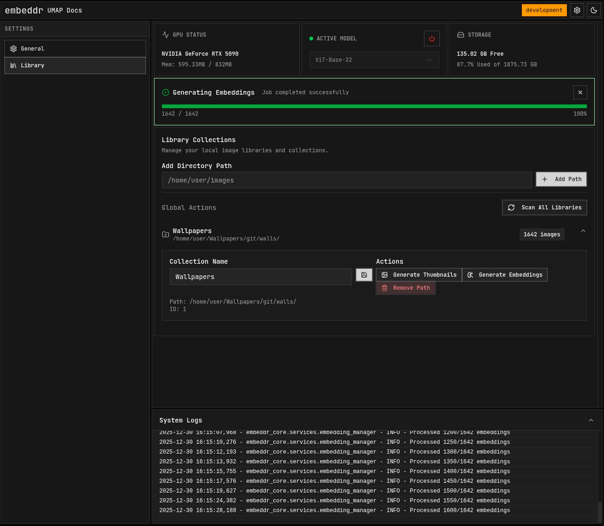

<div align="center"><a name="readme-top"></a>


<h1>Embeddr CLI</h1>
Embeddr is an orchestration layer that turns files, media, and data into structured, searchable artifacts using pluggable engines — all controlled via APIs, MCP, or UI, and stored locally on your machine.
</div>


## Installation

### Using [uv](https://docs.astral.sh/uv/getting-started/installation/)

```sh
# Create a Virtual Environment
mkdir embeddr && cd embeddr
uv venv && source .venv/bin/activate

# Install Torch - https://pytorch.org/get-started/locally/

## EXAMPLES
# - CPU ONLY
uv pip install torch torchvision --index-url https://download.pytorch.org/whl/cpu
# OR
# - CUDA 13.0
uv pip install torch torchvision --index-url https://download.pytorch.org/whl/cu130

# Install Embeddr
uv pip install embeddr-cli
```

## Usage

Once installed to start Embeddr

```sh
> embeddr serve

✨ Embeddr Local API has started!
   ---------------------------------------------
   👉 Web UI:    http://127.0.0.1:8003
   ---------------------------------------------
   Press Ctrl+C to stop server
```

### `embeddr serve`

```sh
--help          Shows help.
--mcp           Enables Model Context Protocol.
--docs          Enable API docs.
--host          The host to bind to. [default: 127.0.0.1]
--port          The port to bind to. [default: 8003]
--plugins-dir   Directory to serve plugins from.
```

### `embeddr config`

```sh
--init   Shows help.
--show   Shows the current configuration.
```

## Integrations

### [ComfyUI Extension](https://github.com/embeddr-net/embeddr-comfyui)

`comfy node install embeddr-extension`


[View Registry](https://registry.comfy.org/publishers/nynxz/nodes/embeddr-extension)

### mcp.json
```json
{
  "mcpServers": {
    "embeddr": {
      "url": "http://localhost:8003/mcp/messages",
      // Set a timeout for long image generations
      "timeout": 120000 
    },
    ...
  }
}
```
### [Mistral Vibe MCP](https://github.com/mistralai/mistral-vibe)

- Run embeddr with `embeddr serve --mcp`
- Add this to your `.vibe/config.toml`
- `vibe`

```toml
[[mcp_servers]]
name = "embeddr"
transport = "http"
url = "http://localhost:8003/mcp/messages"
```

> Anything that uses [Model Context Protocol](https://modelcontextprotocol.io/docs/getting-started/intro) will also work.

## Plugins

Extend Embeddr with custom functionality. Plugins can add new UI panels, backend routes, and database models.

1. **Download** or create a plugin.
2. **Place** it in your plugins directory (default: `~/.local/share/embeddr/plugins`).
3. **Restart** Embeddr.

Check out the [Plugin Examples](https://github.com/embeddr-net/plugin-examples) for templates and guides.

## Screenshots

### Editor (Zen Mode)
With [Layer Editor Plugin](https://github.com/embeddr-net/plugin-examples)


### Home Page



### Lineage Page


### Settings Page




## Development

Instructions to run a development version.

```sh
git clone https://github.com/embeddr-net/embeddr-cli
cd embeddr-cli
uv venv
uv pip install -e .

# Install Torch

# Start Embeddr API with live reload
uv run embeddr serve --reload 
```

> While releases do include the [frontend](https://github.com/embeddr-net/embeddr-frontend), this repo does not.
>
> You can run a [development frontend](https://github.com/embeddr-net/embeddr-frontend?tab=readme-ov-file#Development) or download the [latest version](https://github.com/embeddr-net/embeddr-frontend/releases) and extract it into `embeddr-cli/src/web/`

## Packages

[![pypi version][pypi-image]][pypi-url]
[![embeddr-core version][embeddr-core-image]][embedd-core-url]
[![embeddr-frontend][embeddr-frontend-image]][embedd-frontend-url]
[![embeddr-react-ui version][embeddr-react-ui-image]][embedd-react-ui-url]

[![license][license-image]][license-url]


[pypi-image]: https://img.shields.io/pypi/v/embeddr-cli?style=flat-square&&logo=Python&logoColor=%23ffd343&label=cli&labelColor=%232f2f2f&color=%234f4f4f
[pypi-url]: https://pypi.org/project/embeddr-cli

[embeddr-core-image]: https://img.shields.io/pypi/v/embeddr-core?style=flat-square&logo=Python&logoColor=%23ffd343&label=core&labelColor=%232f2f2f&color=%234f4f4f
[embedd-core-url]: https://pypi.org/project/embeddr-core

[embeddr-react-ui-image]: https://img.shields.io/npm/v/%40embeddr%2Freact-ui?style=flat-square&logo=React&logoColor=%61DBFB&label=react-ui&labelColor=%232f2f2f&color=%234f4f4f
[embedd-react-ui-url]: https://www.npmjs.com/package/@embeddr/react-ui

[embeddr-frontend-image]: https://img.shields.io/npm/v/%40embeddr%2Freact-ui?style=flat-square&logo=React&logoColor=%61DBFB&label=frontend&labelColor=%232f2f2f&color=%234f4f4f
[embedd-frontend-url]: https://github.com/embeddr-net/embeddr-frontend

[license-image]: https://img.shields.io/github/license/embeddr-net/embeddr-cli?style=flat-square&logoColor=%232f2f2f&labelColor=%232f2f2f&color=%234f4f4f
[license-url]: https://pypi.org/project/embeddr-cli
