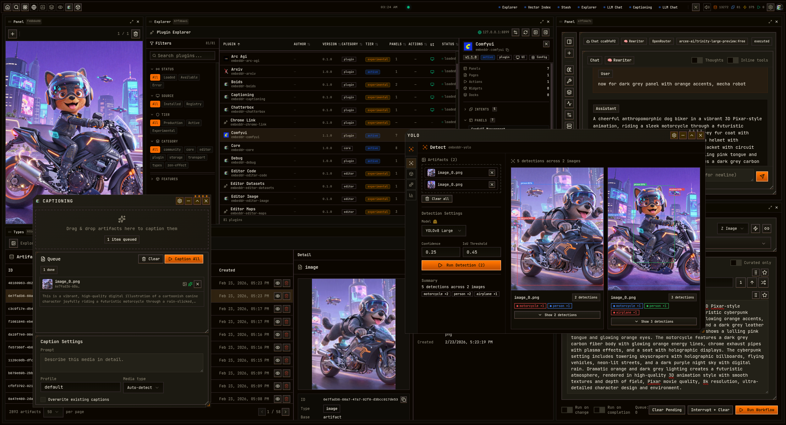
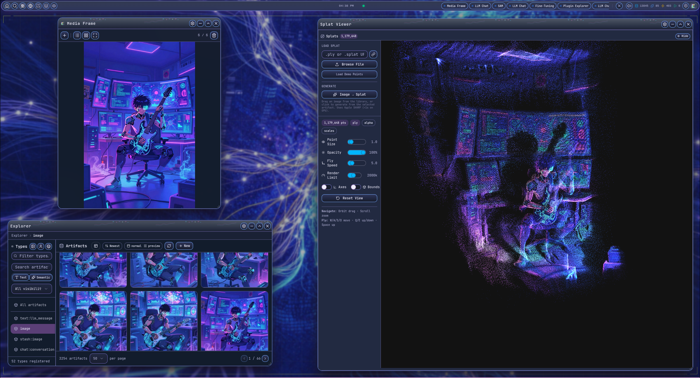
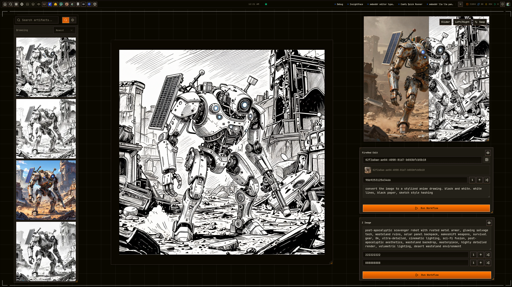
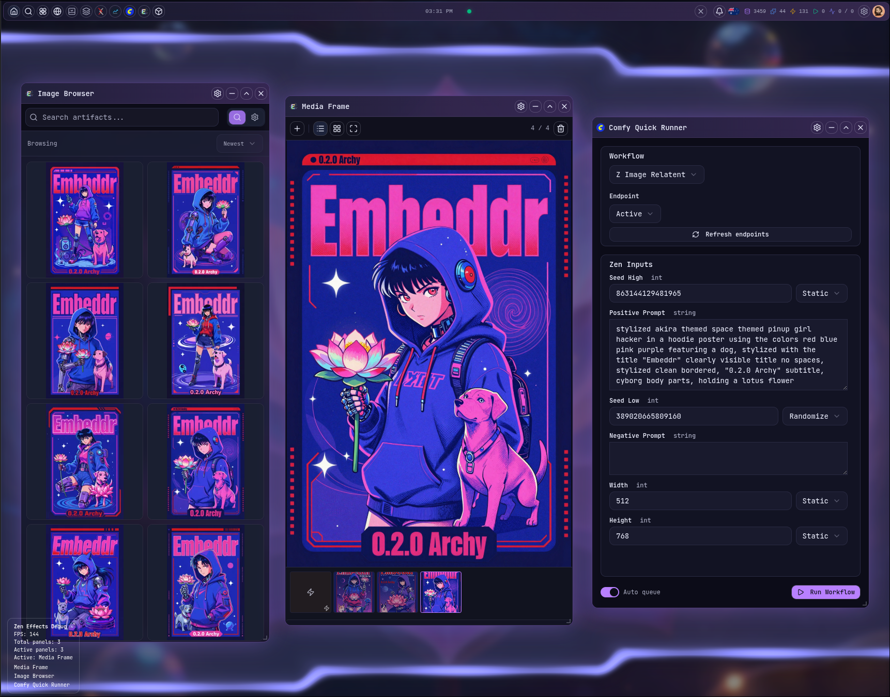
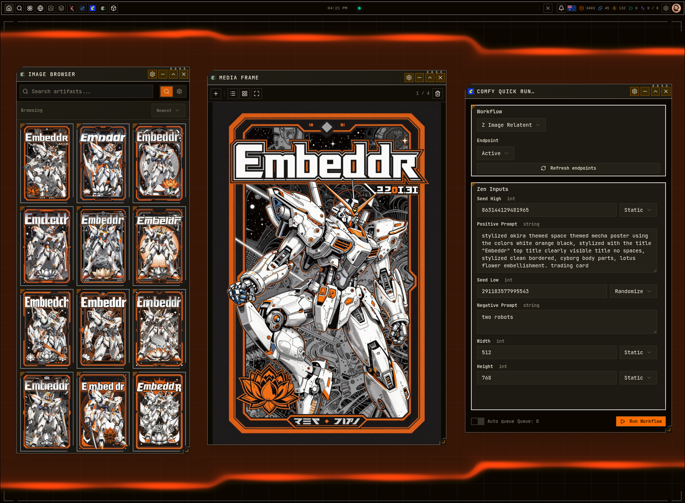
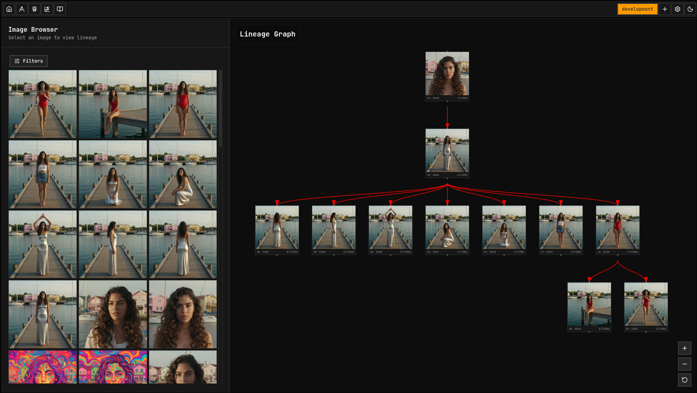

<div align="center"><a name="readme-top"></a>


<h1>Embeddr CLI</h1>

Your personal creative workspace — search, organize, and orchestrate artifacts, media, and AI workflows.

[![pypi version][pypi-image]][pypi-url]
[![embeddr-core version][embeddr-core-image]][embeddr-core-url]
[![license][license-image]][license-url]

</div>

---



## What is Embeddr?

Embeddr is a local-first, plugin-extensible workspace for managing your creative data. Think of it as a personal operating layer for artifacts — images, documents, code, workflows — with semantic search, a relation graph, AI tool integration, and a plugin system that lets you extend everything.

- **Artifact-centric** — everything is an artifact with typed metadata, relations, and lineage
- **Plugin-extensible** — add UI panels, backend routes, new capabilities, and AI tools
- **AI-native** — MCP server, LLM tool calling, Lotus agent integration
- **Local-first** — runs on your machine, your data stays yours

## Installation

### Using [uv](https://docs.astral.sh/uv/getting-started/installation/) (recommended)

```sh
mkdir embeddr && cd embeddr
uv venv && source .venv/bin/activate

# Install Torch — https://pytorch.org/get-started/locally/
# CPU only:
uv pip install torch torchvision --index-url https://download.pytorch.org/whl/cpu
# Or CUDA 13.0:
uv pip install torch torchvision --index-url https://download.pytorch.org/whl/cu130

# Install Embeddr
uv pip install embeddr-cli
```

### Using pip

```sh
pip install embeddr-cli
```

## Quick Start

```sh
# Initialize a workspace
embeddr init

# Start the server
embeddr serve

✨ Embeddr Local API has started!
   ---------------------------------------------
   👉 Web UI:    http://127.0.0.1:8003
   ---------------------------------------------
   Press Ctrl+C to stop server
```

## CLI Reference

### `embeddr serve`

Start the Embeddr API server with the web UI.

```
embeddr serve [OPTIONS]

Options:
  --host TEXT         Host to bind to [default: 127.0.0.1]
  --port INTEGER      Port to bind to [default: 8003]
  --plugins-dir TEXT   Directory to load plugins from
  --mcp               Enable Model Context Protocol endpoint
  --docs              Enable API documentation at /docs
  --reload            Enable live reload for development
  --no-plugins        Start without loading plugins
  --verbose           Verbose logging

Worker mode (distributed processing):
  --worker            Run as a headless worker node
  --main-url TEXT     URL of the main Embeddr instance
  --worker-key TEXT   Authentication key for worker registration
  --worker-name TEXT  Worker display name
  --worker-tags TEXT  Comma-separated worker tags
```

### `embeddr init`

Interactive setup wizard for a new workspace. Creates `embeddr.toml` project config, initializes the database, and walks you through auth and plugin configuration.

### `embeddr config`

```
embeddr config init    # Create embeddr.toml in current directory
embeddr config show    # Display current configuration and paths
```

### `embeddr lotus`

Interact with the Lotus capability system from the command line.

```
embeddr lotus list [--kind action] [--plugin embeddr-llm] [--query "search"]
embeddr lotus query "image generation"
embeddr lotus inspect <capability_id>
embeddr lotus invoke <capability_id> [--input key=value]
```

### Other Commands

| Command | Description |
|---------|-------------|
| `embeddr db` | Database management (migrations, schema) |
| `embeddr plugins` | Plugin lifecycle management |
| `embeddr process` | Artifact processing (scan, embed, analyze) |
| `embeddr inspect` | Query artifacts, metadata, and relations |
| `embeddr tui` | Interactive terminal UI explorer |
| `embeddr system` | System resources and ML model management |
| `embeddr manage` | Account and API key operations |
| `embeddr debug` | Inspect executions, sessions, auth state |

### Global Options

```
--data-dir, -d TEXT   Override data directory (also: EMBEDDR_DATA_DIR env var)
```

## Integrations

### Model Context Protocol (MCP)

Embeddr exposes an MCP endpoint so any MCP-compatible client can use your workspace as a tool server.

```sh
embeddr serve --mcp
```

#### mcp.json

```json
{
  "mcpServers": {
    "embeddr": {
      "url": "http://localhost:8003/mcp/messages",
      "timeout": 120000
    }
  }
}
```

Works with Claude Desktop, [Mistral Vibe](https://github.com/mistralai/mistral-vibe), Cursor, and anything that supports the [Model Context Protocol](https://modelcontextprotocol.io).

### [ComfyUI Extension](https://github.com/embeddr-net/embeddr-comfyui)

Send ComfyUI workflow outputs directly to Embeddr with full lineage tracking.

```
comfy node install embeddr-extension
```


[View on ComfyUI Registry](https://registry.comfy.org/publishers/nynxz/nodes/embeddr-extension)

### [Lotus CLI](https://github.com/embeddr-net/lotus-cli)

AI agent REPL that connects to your Embeddr workspace. Bring your own LLM provider.

```sh
pip install lotus-cli
lotus connect
lotus
```

## Plugins

Extend Embeddr with custom functionality. Plugins can add UI panels, backend routes, database models, and Lotus capabilities.

1. **Download** or create a plugin
2. **Place** it in your plugins directory (default: `~/.local/share/embeddr/plugins`)
3. **Restart** Embeddr

Check out the [Plugin Development Guide](docs/PLUGIN_DEVELOPMENT.md) and [Plugin Examples](https://github.com/embeddr-net/plugin-examples).

## Auth

Four authentication modes to match your deployment:

| Mode | Description |
|------|-------------|
| `open` | No auth required (default for local dev) |
| `single` | Single API key for all access |
| `multi` | Multiple users with scoped API keys |
| `db` | Full database-backed user accounts |

Configure via `embeddr.toml` or `EMBEDDR_AUTH_MODE` env var.

## Screenshots

### Zen Shell — Full Workspace

Panel-based workspace with image browser, media frame, ComfyUI runner, and generation settings.


### Zen Mode — Floating Panels

Minimal floating panel layout with cosmic theme.



### Editor — Generation Workflow

Ink/manga style generation with layer editor plugin and lineage tracking.



### Theming

Fully themeable — dark, light, and custom color schemes.

<p>


</p>

### Lineage

Artifact relation graph showing generation provenance.



## Development

```sh
git clone https://github.com/embeddr-net/embeddr-cli
cd embeddr-cli
uv venv && source .venv/bin/activate
uv pip install -e ".[dev]"

# Install Torch for your platform

# Start with live reload
embeddr serve --reload --docs
```

> Releases include the bundled [frontend](https://github.com/embeddr-net/embeddr-frontend). For development, run the [frontend dev server](https://github.com/embeddr-net/embeddr-frontend?tab=readme-ov-file#Development) or download the [latest release](https://github.com/embeddr-net/embeddr-frontend/releases) and extract it into `embeddr-cli/src/web/`.

## Packages

[![pypi version][pypi-image]][pypi-url]
[![embeddr-core version][embeddr-core-image]][embeddr-core-url]
[![embeddr-frontend][embeddr-frontend-image]][embeddr-frontend-url]
[![embeddr-react-ui version][embeddr-react-ui-image]][embeddr-react-ui-url]

[![license][license-image]][license-url]

[pypi-image]: https://img.shields.io/pypi/v/embeddr-cli?style=flat-square&&logo=Python&logoColor=%23ffd343&label=cli&labelColor=%232f2f2f&color=%234f4f4f
[pypi-url]: https://pypi.org/project/embeddr-cli

[embeddr-core-image]: https://img.shields.io/pypi/v/embeddr-core?style=flat-square&logo=Python&logoColor=%23ffd343&label=core&labelColor=%232f2f2f&color=%234f4f4f
[embeddr-core-url]: https://pypi.org/project/embeddr-core

[embeddr-react-ui-image]: https://img.shields.io/npm/v/%40embeddr%2Freact-ui?style=flat-square&logo=React&logoColor=%61DBFB&label=react-ui&labelColor=%232f2f2f&color=%234f4f4f
[embeddr-react-ui-url]: https://www.npmjs.com/package/@embeddr/react-ui

[embeddr-frontend-image]: https://img.shields.io/npm/v/%40embeddr%2Freact-ui?style=flat-square&logo=React&logoColor=%61DBFB&label=frontend&labelColor=%232f2f2f&color=%234f4f4f
[embeddr-frontend-url]: https://github.com/embeddr-net/embeddr-frontend

[license-image]: https://img.shields.io/github/license/embeddr-net/embeddr-cli?style=flat-square&logoColor=%232f2f2f&labelColor=%232f2f2f&color=%234f4f4f
[license-url]: https://github.com/embeddr-net/embeddr-cli/blob/main/LICENSE

## License

Copyright 2026 Embeddr Labs and Contributors

Licensed under the Apache License, Version 2.0 (the "License");
you may not use this project except in compliance with the License.
You may obtain a copy of the License at:

<http://www.apache.org/licenses/LICENSE-2.0>
